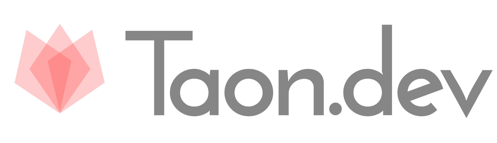

<p style="text-align: center;"></p>

/* cspell: disable-next-line */
TAON  **T**ypescript **A**ngular **O**rm **N**ode )


( BETA VERSION - MAJOR REFACTOR IN PROGRESS )

**Taon** 🔥🔥🔥 is a solution (**global cli tool** & **framework**) for

\+
[TypesScript](https://www.typescriptlang.org/)  

\+
[Angular](https://angular.io/) (PWA)

\+ Orm with [TypeORM](https://typeorm.io/)
- [sql.js](https://sql.js.org) - NODEJS SERVER MODE
- [sql.js](https://sql.js.org) - *WEBSQL SERVER MODE
- [mysql](https://www.mysql.com/) - SERVER IN DOCKER (work in progress)

\+
[NodeJS](https://nodejs.org/en/)

\+
[RxJs](https://rxjs.dev/)  / [NgRx](https://ngrx.io/) (optional) 

\+
[Electron](https://www.electronjs.org/) desktop apps (work in progress)

\+
[Storybook](https://storybook.js.org/docs/get-started/angular) showcase (work in progress)

<ins>backend/frontend [*isomorphic](https://en.wikipedia.org/wiki/Isomorphic_JavaScript)  apps/libs.</ins>

**[READ DOCUMENTATION](https://taon.io/#/docs)**

<br>
<br>

### Initial requirements of taon
1. Installed git


(for windows only git bash supported https://gitforwindows.org)


2. (linux only) Increased watchers limit:
```/* cspell: disable-next-line */
echo fs.inotify.max_user_watches=524288 | sudo tee -a /etc/sysctl.conf && sudo sysctl -p
```

<br>
<br>

### Projects that are part of taon.dev:
- taon https://github.com/darekf77/taon
    + framework library
- tnp https://github.com/darekf77/tnp
    + main cli / code structuring tool
- taon-core https://github.com/darekf77/tnp-core
    + essential/core helpers for all projects
- taon-class-helpers https://github.com/darekf77/typescript-class-helpers
    + helpers for OOP class names based
- taon-config https://github.com/darekf77/tnp-config
    + config/models for general purpose
- taon-cli https://github.com/darekf77/tnp-cli
    + helpers/abstraction for global cli tools NodeJS based
- taon-helpers https://github.com/darekf77/tnp-helpers
    + extended core helpers
- taon-json https://github.com/darekf77/json10
    + handle JSON in better way
- taon-logger https://github.com/darekf77/ng2-logger
    + logging in isomorphic apps
- taon-typeorm https://github.com/darekf77/taon-typeorm
    + TypeOrm fork 
- taon-type-sql https://github.com/darekf77/taon-type-sql
    + strongly type sql
- taon-rest https://github.com/darekf77/ng2-rest
    + easy rest api
- taon-incremental-watcher https://github.com/darekf77/incremental-compiler
    + abstraction for incremental builders NodeJS based 
- taon-storage https://github.com/darekf77/taon-storage
    + ts decorators based storage solution
- taon-walk-object https://github.com/darekf77/lodash-walk-object
    + iterate over deep properties in object


### Global npm dependencies installed with taon 
Installation happens when you first time use taon
<!-- /* cSpell:disable */ -->
<pre>
{ name: 'ncc', version: '0.36.0', installName: '@vercel/ncc' },
{ name: 'extract-zip', version: '1.6.7' },
{ name: 'cpr' },
{ name: 'check-node-version' },
{ name: 'npm-run', version: '4.1.2' },
{ name: 'rimraf', version: '3.0.2' },
{ name: 'mkdirp' },
{ name: 'renamer', version: '2.0.1' },
{ name: 'nodemon' },
{ name: 'madge' },
{ name: 'yarn' },
{ name: 'taon-http-server' },
{ name: 'prettier' },
{ name: 'fkill', installName: 'fkill-cli' },
{ name: 'mocha' },
{ name: 'jest' },
{ name: 'ts-node' },
{ name: 'taon-vsce' },
{ name: 'webpack-bundle-analyzer' },
{ name: 'babel', installName: 'babel-cli' },
{ name: 'javascript-obfuscator', version: '4' },
{ name: 'uglifyjs', installName: 'uglify-js' },
</pre>

<!-- /* cSpell:enable */ -->
