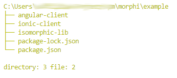

<div align="center">
  


  <h1>Morphi v2 (BETA)</h1>
  <p>
    Iso<b>morphi</b>c framework in TypeScript for NodeJS back-end and browser (web/mobile) front-end. 
    <br><br><br>
   <strong > Do no repeat yourself anymore, never !!! </strong>
    <br>    
    <br>
    <ul style="list-style-type:none;" >
      <li style="margin-top:20px" >-<strong>NO MORE SEPARATION BETWEEN BACKEND AND FRONTEND !</strong></li>
      <li style="margin-top:20px" >- <strong>Isomorphic classes</strong> as Angular/Ionic Services and ExpressJS controllers. </li>
      <li style="margin-top:20px"><strong>One <u>node_modules</u> folder</strong> for browser, mobile and server.</li>
      <li style="margin-top:20px">-<strong> Write everything in TypeScript</strong> 
      all the time and <br> automaticly strip off server code for browser/ionic versions.</li>
      <li style="margin-top:20px">- Use power of  <a style="color:red;" href="https://github.com/typeorm/typeorm">TypeORM</a>
       framwork to write awesome, robust, clean NodeJS backend <br>
       connected to SQLite, Mysql, WebSQL, MongoDB and many others... </li>
      <li style="margin-top:20px">- <strong>Keep amazing code consistency</strong>
        thanks to isomorphic entities classes, that you can use to<br>
        create backend tables and also inside frontend-angular templates with type checking.        
      </li>
       <li style="margin-top:20px">- <strong>Change business logic in the fastest possible way!</strong>
        <br>- generate  <a style="color:red;"  href="https://ng2.angular-formly.com/">formly</a> objects from entites
        <br>- have typescript typechecking from entity in db to html template!
        <br>- set default values to entities
       </li>
      <li  style="margin-top:20px;font-size:90%" >Support project to develop only amazing, creative things
      in the future... 
      </li>
      <li  style="margin-top:20px;font-size:90%" > Project is under development, but every 
        juicy features just works... try example.
      </li>
      <li>
        <br>
        <br>
        TODO: <br>
        - firebase like... realtime update of backend/frontend (in progress) <br>
        - extended authentication based on isomorphic decorators metadata and db roles (in progress) <br>
        - isomoprhic unit tests (with inheritance) in mocha/jasmine  <br>
        - vscode extension to support @backend, @backendFunc #regions <br>
      </li>
    </ul>
  <p>
</div>


# Instalation
### Global CLI
First install global tool:
```
npm install -g morphi
```
### Create new **Isomorphic Workspace** project ( mobile, web, server + sqlite db + basic rest authentication ) 
```
morphi new:workspace myAwesomeIsomrphicApp
```
### OR create **Isomorphic Single File**  backend/frontend project
```
morphi new:simple myAwesomeIsomrphicApp
```
### Visual Studio Code (recommended editor)
Open your project in *VSCode* to get the maximum of development experience.
```
code myAwesomeIsomrphicApp
```

# Installation - Isomorphi Workspace

### Link one version of node_modules
Once you have your app opened... 



run:
```
npm install
npm run link
```
to install and link *node_module* folder for each subproject.
### Build and run sub-projects with auto-reload
- isomorphic-lib: `npm run build:watch #or morphi:watch  ` + F5 to run server
- angular-client: `npm run build:watch` + open browser [http:\\\\localhost:4200](http:%5C%5Clocalhost:4200)
- ionic-client: `npm run build:watch` + open browser [http:\\\\localhost:8100](http:%5C%5Clocalhost:8100)

Instead of `npm run build:watch` you can also open each sub-project in separated vscode window `code <sub-project-name>`
and press: **ctrl(cmd) + shift + b**.

# Installation - Isomorphi Single File
### Install dependencies
Once you have your app opened... run:
```
npm install
```

### Run isomorphic build 
```
morphi build:watch
```

### Run frontend client
```
npm run build:watch
```


# Backend controllers, entities directly in the frontend
## Isomorphic TypeScript Classes

The main reason why this framework has huge potential is that you can use your backend code 
( usualy ExpressJS, REST controllers ) as Anguar 2+ (or any other js framework)
services, to access your RESTfull backend without dealing with backend patches and unessery source code.

This will allow you to change business login very quickly, without confusion and keep
no separation between your frontend/backend application.

## Morphi CLI tool
 Is responsible for magic behing stripping of backend code for browser version ( web app or ionic mobile app).

## Regions *@backend,@backendFunc*
The difference between @backend and @backendFunc is that @backendFunc will replace code with 'return undefined' (it is needed for typescript compilation) and @backend
will precisely delete all lines between.

# HOW IT WORKS: 
## + Isomorphi initilization
 
 Initialization for backend and frontend
```ts
import { Morphi } from 'morphi';


@Morphi.init({
  controllers: [ /* Your controllers clases here */ UserController  ],
  entites: [ /* Your entites clases here */  User ],
  host: 'http://localhost:4000' // host for backend and frontend,
  //#region @backend
  config: { /* Your db config clases here */  }
  //#endregion
})

```
 
To inject providers you can use
```ts
import { Morphi } from 'morphi';

...
  providers: [  ...Morphi.Providers  ]
...

```

## + Isomorphi backend 


Typeorm isomorphic ENTITY in NodeJS backend:
```ts
import { Morphi } from 'morphi';

@Morphi.Entity()
export class User {

    //#region @backend
    @Morphi.Orm.Column.Primary()
    //#endregion
    id: number;

    //#region @backend
    @Morphi.Orm.Column.Custom()
    //#endregion
    name: string;

    //#region @backend
    @Morphi.Orm.Column.Custom()
    //#endregion
    surname: string;

    fullName() {
      return `${this.name} ${this.surname}`
    }
    
    //#region @backend 
    password: string
    //#endregion

}
```


Morphi isomorphic CONTROLLER in NodeJS backend:
```ts
import { Morphi } from 'morphi'

@Morphi.Controller() 
class UserController {
		
	@Morphi.Http.GET()
	getAllUser() {
		//#region @backendFunc 
		const  repository  =  this.connection.getRepository(User) as  any;
		return  async (req, res) => {
			return await  this.repository.findAll();
		}
		//#endregion
	}	
}

```
After **isomorphic compilation** by morphi;
```
morphi build
```
or (incremental watch build)
```
morphi build:watch
```
will be generated browser version.


## + Generated borwser version

The result for browser client will be like below:

Typeorm isomorphic ENTITY in browser version:
```ts
import { Morphi } from 'morphi/browser';

@Morphi.Entity()
export class User {

    id: number;

    name: string;

    surname: string;

    fullName() {
      return `${this.name} ${this.surname}`
    }
}
```

 Morphi isomorphic CONTROLLER in browser version:
```ts
import { Morphi } from 'morphi/browser'

@Morphi.Controller()
class UserController {
	 // 'return undefined' is for purpose on the browser side
	 // The function body will be replaced through decorate
	 // to access REST endpoint
	@Morphi.Http.GET()
	getAllUser() { 
    return undefined; 
    }	
}
```

# Angular 2+ services

Morphi.Controller(s) you can use as **Angular 2+ services**. If you
used Morphi.Entity your browser <-> backend REST communication will
keep entity type and automaticly reproduce it.
```ts
@Component({
	selector:  'app-test',
	templateUrl:'app-test.html'
})
class  AppTestComponent  implements  OnInit {

	// Inject isomorphic class as service into component
	constructor(public users: UserController) { } 
	
	async ngOnInit() {
          const data = await this.users.getAllUsers().received;
          const users = data.body.json;
          const firstUser = users[0]
          console.log( firstUser instanceOf User ) // true
	}
}
```

## Directly in html template
To simplify object receiving from backend you can use **async** pipes (available with Angular4+) 
and really make you MVVM amazing.

Morphi and Angular4+ lets you use backend functions in html frontend template.

**app-test.html**  
```html
Users:
<ul   *ngIf="users.getAllUsers().received.observable | async; else loader; let users" >

  <li  *ngFor="let user of users"> 
  		{{user.id}} {{user.fullName()}} <!-- BACKEND FUNCTION IN FRONTEND TEMPLATE ! -->
		  <br>
		<input type="name" [(NgModel)]="user.name" >
  </li>

</ul>

<ng-template #loader> loading users...  </ng-template>

```


Of course Angular services can be used inside Angular web and Ionic mobile apps. 

# RULES

### 1. Controlers, Entites classes names matters.
### 2. Each new context onlyt with diffrent host allowed
### 3. Each Controller or Entity only allowed to be inside one context.


