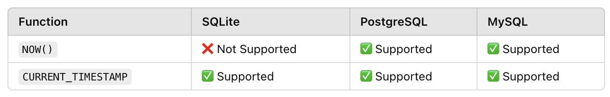

# SQL - best practices

## End transactions in proper way
let say we have migration started:
```ts
queryRunner.startTransaction();
```
to end transaction:
```ts
queryRunner.release();  // IT IS NOT ENOUGH
                        // and this may cause weird errors

// proper 'end' of transaction
queryRunner.commitTransaction();
queryRunner.release();
```


## Use CURRENT_TIMESTAMP instead NOW()




## Use integer instead int

sqlite does not support it
